# 🚀 Yeahia Nurul Amin

<div align="center">
  
  <!-- Animated Profile Picture with Glow Effect -->
  
  
  <!-- Typing Animation Header -->
  <h1>
    
  </h1>

  <!-- Animated Subtitle -->
  <p align="center">
    
  </p>

  <!-- Social Badges with Hover Effects -->
  <div style="margin: 20px 0;">
    <a href="https://www.linkedin.com/in/yeahia-nurul-amin-5b87aa366/" target="_blank">
      
    </a>
    <a href="mailto:yeahianurulamin8800@gmail.com">
      
    </a>
    
  </div>

  <!-- Current Focus Animation -->
  <p>
    
  </p>

</div>

---

## 🌟 About Me


```javascript
const yeahia = {
  currentStatus: "Computer Science Student",
  focus: ["React", "Express.js", "Full-Stack Development"],
  nextGoals: ["Next.js", "TypeScript", "Cloud Deployment"],
  philosophy: "Innovation through collaboration",
  funFact: "I debug with console.log() and I'm not ashamed! 😄"
};

console.log(yeahia.philosophy);
// "Innovation through collaboration"
```

- 🌱 Currently diving deep into **React** & **Express.js**
- 🎯 Next milestone: **Next.js** for full-stack mastery
- 💡 I create **practical solutions** with a creative twist
- 🤝 Strong believer in **collaborative development**
- 🚀 Goal: Building impactful products as a full-stack developer

---

## 🛠️ Tech Arsenal

<div align="center">

### Languages & Frameworks
<p>
  
</p>

### Databases & Tools
<p>
  
</p>

### Learning Next
<p>
  
</p>

</div>

---

## 📈 Skill Proficiency

<div align="center">

| Technology | Proficiency | Experience |
|------------|-------------|------------|
| **JavaScript** |  | 🔥🔥🔥⚪⚪ |
| **HTML & CSS** |  | 🔥🔥🔥🔥⚪ |
| **C++** |  | 🔥🔥🔥⚪⚪ |
| **Java** |  | 🔥🔥🔥⚪⚪ |
| **React** |  | 🔥🔥⚪⚪⚪ |
| **Databases** |  | 🔥🔥🔥⚪⚪ |

</div>

---

## 🚀 Learning Journey

```mermaid
graph LR
    A[React Fundamentals] --> B[Express.js Mastery]
    B --> C[Next.js Deep Dive]
    C --> D[TypeScript Integration]
    D --> E[Testing & Deployment]
    
    style A fill:#61DAFB
    style B fill:#000000
    style C fill:#000000
    style D fill:#3178C6
    style E fill:#47A248
```

<details open>
<summary><h3>🎯 Current Roadmap</h3></summary>



**Phase 1: Foundation** ✅
- [x] HTML/CSS Mastery
- [x] JavaScript Fundamentals
- [x] Git & Version Control

**Phase 2: Frontend** 🔄
- [ ] React Hooks & Context
- [ ] Component Architecture
- [ ] State Management

**Phase 3: Backend** 🔄
- [ ] Express.js & REST APIs
- [ ] Database Integration
- [ ] Authentication & Security

**Phase 4: Full-Stack** 🔮
- [ ] Next.js Framework
- [ ] TypeScript
- [ ] Testing & Deployment

</details>

---

## 🎨 Featured Projects

<div align="center">

<table>
<tr>
<td width="50%" align="center">

### 🎨 Leon Template

<p align="center">
  
  
  
</p>

Modern, responsive landing page template featuring elegant design and smooth animations. Built with pure HTML, CSS, and JavaScript showcasing creative layout design and user interface development skills.

**Key Features:**
- 📱 Fully responsive design
- ✨ Smooth animations
- 🎨 Modern UI/UX
- 🚀 Fast loading

<p>
  <a href="https://github.com/YeahiaNurulAmin/Tempate_Leon" target="_blank">
    
  </a>
  <a href="https://yeahianurulamin.github.io/Tempate_Leon/" target="_blank">
    
  </a>
</p>

</td>
<td width="50%" align="center">

### 🌟 Kasper Template

<p align="center">
  
  
  
</p>

Creative agency template with stunning visuals and interactive elements. A showcase of advanced CSS techniques and modern web design principles with emphasis on visual storytelling and user engagement.

**Key Features:**
- 🎭 Creative design approach
- 🖼️ Visual storytelling
- 💫 Interactive elements
- 📐 Pixel-perfect layout

<p>
  <a href="https://github.com/YeahiaNurulAmin/Template_Kasper" target="_blank">
    
  </a>
  <a href="https://yeahianurulamin.github.io/Template_Kasper/" target="_blank">
    
  </a>
</p>

</td>
</tr>
</table>

### 🚀 More Projects Coming Soon!

```javascript
const upcomingProjects = {
  reactTaskManager: {
    stack: ["React", "Express", "MongoDB"],
    status: "In Development",
    progress: "🔄 Planning Phase"
  },
  nextjsPortfolio: {
    stack: ["Next.js", "TypeScript", "Tailwind"],
    status: "Design Phase", 
    progress: "🎨 UI/UX Design"
  },
  fullStackEcommerce: {
    stack: ["MERN Stack"],
    status: "Roadmap",
    progress: "📋 Architecture Planning"
  }
};

console.log("Building the future, one project at a time! 🚀");
```

</div>

---

## 📊 GitHub Analytics

<div align="center">


</div>

---

## 🌐 Connect & Collaborate

<div align="center">

### 💬 Let's Build Something Amazing Together!

<p>
  
</p>

**Reach out for:**
- 🤝 Collaboration opportunities
- 💼 Internship discussions  
- 🧠 Knowledge sharing
- 💡 Project ideas

<p>
  <a href="https://www.linkedin.com/in/yeahia-nurul-amin-5b87aa366/" target="_blank">
    
  </a>
  <a href="mailto:yeahianurulamin8800@gmail.com">
    
  </a>
</p>

</div>

---

<div align="center">

### 🎯 Philosophy

> *"In the world of code, every bug is a lesson, every feature is a victory,*  
> *and every collaboration is a step toward innovation."*


<p>
  
</p>

</div>

---

<div align="center">
  
</div>
