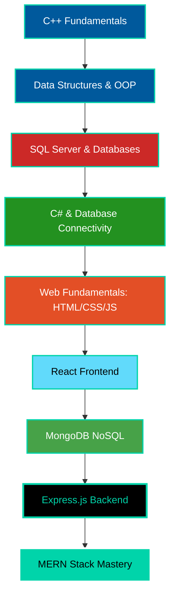

# 🚀 Yeahia Nurul Amin

<div align="center">
  
  
  
  <h1>
    
  </h1>

  <p align="center">
    
  </p>

  <div style="margin: 25px 0;">
    <a href="https://www.linkedin.com/in/yeahia-nurul-amin-5b87aa366/" target="_blank">
      
    </a>
    <a href="mailto:yeahianurulamin8800@gmail.com">
      
    </a>
    
  </div>

</div>

---

## 🎯 About Me


```javascript
const yeahia = {
  education: "Computer Science Student",
  expertise: ["MERN Stack", "C++", "Database Design"],
  currentProject: "Full-Stack MERN Application (near completion)",
  languages: ["JavaScript", "C++", "C#", "Java", "Python", "PHP"],
  passions: ["Problem Solving", "System Design", "Web Development"],
  learningStyle: "Fundamentals → Application → Mastery"
};

console.log(`Building: ${yeahia.currentProject}`);
```

**My Journey in Brief:**
- 🏗️ Started with **C++ fundamentals**, Data Structures & OOP
- 🗄️ Mastered **SQL Server** and database connectivity with **C#**
- 🌐 Transitioned to **Web Development** (HTML, CSS, JavaScript)
- ⚛️ Advanced to **React** for modern frontend development
- 🔧 Completed the stack with **MongoDB** and **Express.js**
- 🚀 Now building production-ready **MERN Stack** applications

---

## 💼 Technical Arsenal

<div align="center">

### Core Technologies

<table>
<tr>
<td align="center" width="25%">
<br>
<sub><b>C++</b></sub><br>
<sub>DSA & OOP Foundation</sub>
</td>
<td align="center" width="25%">
<br>
<sub><b>C#</b></sub><br>
<sub>Desktop Applications</sub>
</td>
<td align="center" width="25%">
<br>
<sub><b>JavaScript</b></sub><br>
<sub>Full-Stack Development</sub>
</td>
<td align="center" width="25%">
<br>
<sub><b>React</b></sub><br>
<sub>Modern UI Development</sub>
</td>
</tr>
</table>

### Full-Stack Proficiency

<table>
<tr>
<td align="center" width="20%">
<br>
<sub><b>HTML5</b></sub>
</td>
<td align="center" width="20%">
<br>
<sub><b>CSS3</b></sub>
</td>
<td align="center" width="20%">
<br>
<sub><b>MongoDB</b></sub>
</td>
<td align="center" width="20%">
<br>
<sub><b>Express.js</b></sub>
</td>
<td align="center" width="20%">
<br>
<sub><b>Node.js</b></sub>
</td>
</tr>
</table>

### Additional Languages & Tools

<p>
  
</p>

</div>

---

## 📚 Learning Path

<div align="center">



</div>

### Key Milestones

<table>
<tr>
<td width="33%">

**Phase 1: Foundation**
- ✅ C++ Programming
- ✅ Arrays, Vectors, Maps
- ✅ Stacks & Queues
- ✅ Object-Oriented Programming
- ✅ Relational Databases (SQL Server)
- ✅ C# & Database Integration

</td>
<td width="33%">

**Phase 2: Web Development**
- ✅ HTML5 Semantic Markup
- ✅ CSS3 & Responsive Design
- ✅ JavaScript ES6+
- ✅ React Components & Hooks
- ✅ State Management
- ✅ Portfolio Development

</td>
<td width="33%">

**Phase 3: Full-Stack**
- ✅ MongoDB Database Design
- ✅ Express.js REST APIs
- ✅ MERN Stack Integration
- 🔄 Production Deployment
- 🎯 Advanced State Management
- 🎯 TypeScript Migration

</td>
</tr>
</table>

---

## 🚀 Featured Projects

<div align="center">

### 💻 Desktop Applications

<table>
<tr>
<td width="33%" align="center">

#### 🏧 ATM System


Comprehensive ATM simulation with account management, transactions, and security features. Demonstrates OOP principles and data structure implementation.

</td>
<td width="33%" align="center">

#### 🏦 Mini Bank System


Banking system featuring account operations, transaction history, and customer management using advanced C++ concepts.

</td>
<td width="33%" align="center">

#### ⭕ Tic Tac Toe


Interactive game built with Windows Forms, showcasing GUI development and event-driven programming.

</td>
</tr>
</table>

### 🌐 Web Projects

<table>
<tr>
<td width="50%" align="center">

#### 🎨 Leon Template


Modern, responsive landing page with elegant animations and clean design. Perfect pixel-precision and mobile-first approach.

<a href="https://github.com/YeahiaNurulAmin/Tempate_Leon">
  
</a>
<a href="https://yeahianurulamin.github.io/Tempate_Leon/">
  
</a>

</td>
<td width="50%" align="center">

#### 🌟 Kasper Template


Creative agency template featuring stunning visuals, interactive elements, and advanced CSS techniques for visual storytelling.

<a href="https://github.com/YeahiaNurulAmin/Template_Kasper">
  
</a>
<a href="https://yeahianurulamin.github.io/Template_Kasper/">
  
</a>

</td>
</tr>
<tr>
<td width="50%" align="center">

#### 💼 Interactive Portfolio


Dynamic portfolio website with smooth animations, interactive UI components, and responsive design showcasing JavaScript proficiency.

</td>
<td width="50%" align="center">

#### ✅ To-Do List App


Modern task management application built with React, featuring state management, component lifecycle, and hooks implementation.

</td>
</tr>
</table>

### 🔥 Current Project

<table>
<tr>
<td align="center">

#### 🚀 Full-Stack MERN Application
<p>
  
  
  
  
</p>

**Status:** 🔄 Near Completion | **Progress:** 85%

Complete full-stack web application demonstrating end-to-end development skills:
- ⚛️ React frontend with modern hooks and state management
- 🔧 RESTful API built with Express.js
- 🗄️ MongoDB database with optimized schemas
- 🔐 Authentication & authorization
- 📱 Fully responsive design
- 🚀 Production-ready architecture

*Coming Soon: Repository & Live Demo*

</td>
</tr>
</table>

</div>

---

## 📊 GitHub Statistics

<div align="center">

<a href="https://github.com/YeahiaNurulAmin">
  
</a>
<a href="https://github.com/YeahiaNurulAmin">
  
</a>

<br/>

<a href="https://github.com/YeahiaNurulAmin">
  
</a>

<br/>

<a href="https://github.com/YeahiaNurulAmin">
  
</a>

</div>

---

## 🎯 Technical Proficiency

<div align="center">

| Category | Technologies | Proficiency |
|----------|-------------|-------------|
| **Programming** | C++, JavaScript, C#, Java, Python, PHP |  |
| **Frontend** | HTML5, CSS3, React, Responsive Design |  |
| **Backend** | Express.js, Node.js, REST APIs |  |
| **Databases** | MongoDB, SQL Server, MySQL |  |
| **Data Structures** | Arrays, Vectors, Maps, Stacks, Queues |  |
| **Paradigms** | OOP, Functional Programming, Event-Driven |  |

</div>

---

## 🌱 What's Next?

<div align="center">

```javascript
const roadmap2026 = {
  immediate: [
    "Complete & Deploy MERN Application",
    "Master Advanced React Patterns",
    "TypeScript Integration"
  ],
  shortTerm: [
    "Next.js Framework",
    "Testing (Jest, React Testing Library)",
    "CI/CD Pipelines"
  ],
  longTerm: [
    "Cloud Deployment (AWS/Azure)",
    "Microservices Architecture",
    "System Design Mastery"
  ]
};

console.log("The journey continues... 🚀");
```

</div>

---

## 🤝 Let's Connect

<div align="center">


**I'm interested in:**
- 💼 Full-Stack Development Opportunities
- 🤝 Open Source Contributions
- 🧠 Technical Discussions & Knowledge Sharing
- 🚀 Collaborative Projects

<p>
  <a href="https://www.linkedin.com/in/yeahia-nurul-amin-5b87aa366/">
    
  </a>
  <a href="mailto:yeahianurulamin8800@gmail.com">
    
  </a>
</p>

</div>

---

<div align="center">

### 💭 Developer Philosophy

> *"From C++ fundamentals to full-stack mastery —*  
> *every line of code is a step toward building impactful solutions."*

<br>


<br>

**⭐ If you find my work interesting, consider starring my repositories!**

</div>

---

<div align="center">
  
</div>
